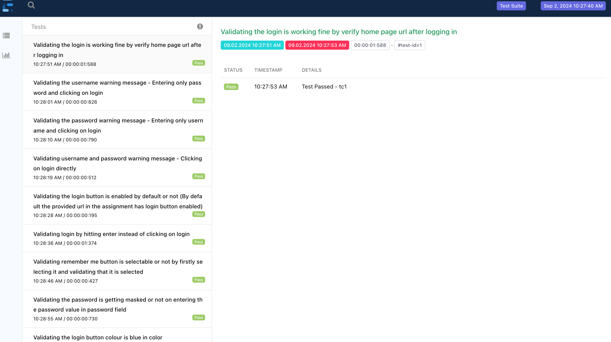
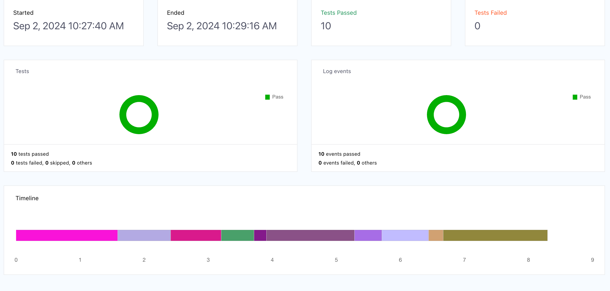

### Steps to execute testcases(Total 10 Functional tcs were covered)
- Navigate to testng.xml and run using run testng.xml option

### Reports 
- Extent reports can be found under src/test/resources/reports/ folder

### tests are found under
- src/test/java/tests/ folder

Report can be found below - 

